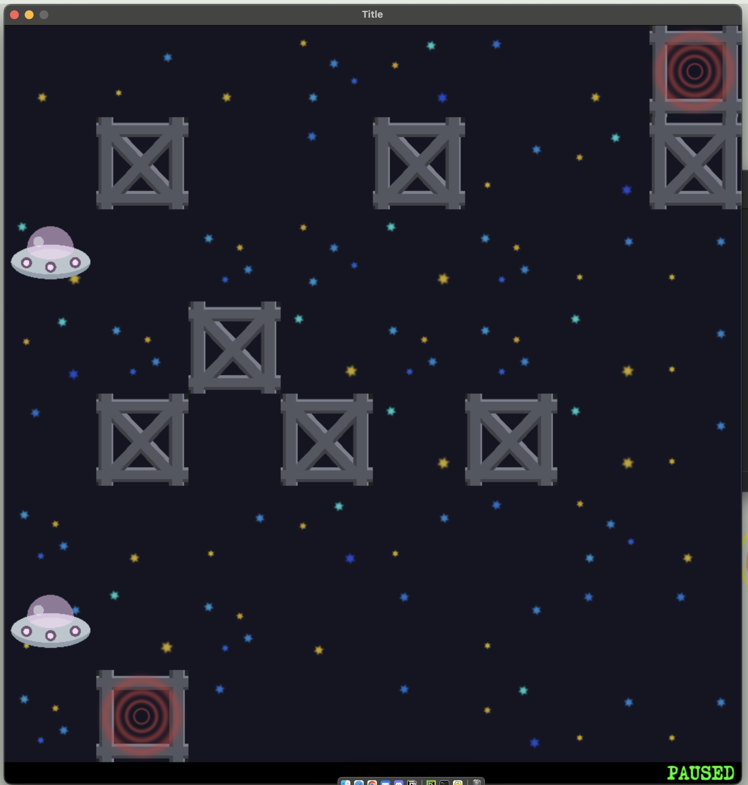

# Starship-Pathfinding 🚀

**Starship-Pathfinding** is a graphical simulation that demonstrates the behavior of basic search algorithms. In this simulation, spaceships navigate through a space map using predefined search strategies to reach parking spots. 🌌

## Algorithms in the Game:
- **DFS (Depth-First Search)** 
- **BFS (Breadth-First Search)** 
- **Branch and Bound** 
- **A⭐ Search** 

## 📋 Project Description:
The simulation is based on a grid map of space fields where spaceships move from their starting positions to a goal. Each spaceship uses a different search algorithm, allowing the testing of algorithm efficiency in solving the problem.

### Goal:
Move all spaceships to their parking spots using the chosen search algorithm.

## 🛠️ Setup and Running the Project

1. Clone or download the repository. 📥
   
    ```bash
    git clone PROJECT_URL

3. Install Dependencies.

    ```bash
    pip install pygame

4. Running the Project.
   
    ```bash
    python ./materials/main.py algorithm map timeout

Parameters:
  algorithm: The search algorithm you want to use (name of Algorithm) (default is ExampleAlgorithm).
  map: The name of the map to be used (default is example_map.txt).
  timeout: The maximum runtime for the simulation (default is 0, meaning no timeout).

4. User Interface.
After running the simulation, a graphical window will appear showing the map. The following controls are available:

- Space: Start or pause the simulation.
- Enter: Show the final solution (spaceship path).
- Esc: Close the application.

## 🗺️ Map Format:
Maps are represented as text files containing a matrix with:

- _ for empty fields (passable),
- O for obstacles (blocks movement),
- S for spaceships,
- G for parking spots (goals).

- Example: 
   ```bash

    _ _ _ _ _ _ _ G
    _ O _ _ O _ _ O
    S _ _ _ _ _ _ _
    _ _ O _ _ _ _ _
    _ O _ O _ O _ _
    _ _ _ _ _ _ _ _
    S _ _ _ _ _ _ _
    _ G _ _ _ _ _ _
   

## 🖼️ Screenshot



